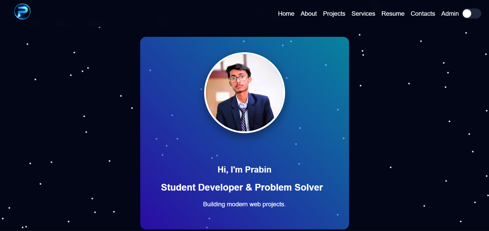

<!-- ANIMATED HEADER -->


<!-- BADGES -->
<div align="center">

<br/>

<a href="https://prabinyadav.dev">

</a>
<a href="https://github.com/hell-codes">

</a>
<a href="https://linkedin.com/in/prabinyadav">

</a>

<br/><br/>

<a href="https://visitorbadge.io/status?path=hell-codes%2Fprabinyadav-portfolio">

</a>
<a href="https://github.com/hell-codes">

</a>

<br/><br/>

<!-- ANIMATED TYPING -->


<br/><br/>

<!-- ANIMATED SNAKE CONTRIBUTION GRAPH -->
<picture>
  <source media="(prefers-color-scheme: dark)" srcset="https://raw.githubusercontent.com/hell-codes/hell-codes/output/github-snake-dark.svg"/>
  <source media="(prefers-color-scheme: light)" srcset="https://raw.githubusercontent.com/hell-codes/hell-codes/output/github-snake.svg"/>
  
</picture>

</div>

<!-- PREVIEW IMAGE -->
<br/>

<div align="center">
<a href="https://prabinyadav.dev">

</a>
<br/>
<sup><i>↑ &nbsp;Click to visit <b>prabinyadav.dev</b></i></sup>
</div>

<br/>

<!-- QUOTE BOX -->
<div align="center">

```
╭─────────────────────────────────────────────────────────────────────────────╮
│                                                                             │
│   " A developer portfolio that feels like a product — not a template "     │
│                                                                             │
│     Dark luxury aesthetic  ·  Real cloud backend  ·  Zero dependencies     │
│                                                                             │
╰─────────────────────────────────────────────────────────────────────────────╯
```

</div>

<!-- DIVIDER -->


<br/>

<!-- GLANCE STATS -->
<div align="center">

## 🏏 &nbsp;At a Glance

<br/>

<table>
<tr>
<td align="center">

<br/><sub>+ Admin Panel</sub>
</td>
<td align="center">

<br/><sub>One per page, unique</sub>
</td>
<td align="center">

<br/><sub>Pure browser APIs</sub>
</td>
<td align="center">

<br/><sub>Firestore + Auth</sub>
</td>
<td align="center">

<br/><sub>prabinyadav.dev</sub>
</td>
</tr>
</table>

</div>

<br/>


<br/>

## 🏏 &nbsp;Why This Portfolio Stands Out

<br/>

<table>
<tr>
<td width="50%" valign="top">

### 🎨 &nbsp;Designed with Intention

Every page has its own **unique animated Canvas background** — particles, waves, hexagons, orbs, falling lines, rising dots. None share a scene. Custom cursor, scroll progress bar, magnetic hover effects, animated skill bars — every detail handcrafted in pure Vanilla JS.

> Not a single line from Bootstrap, Tailwind, or any UI library.

</td>
<td width="50%" valign="top">

### ⚙️ &nbsp;Engineered with Care

**Firebase Firestore** as live cloud backend — projects from the admin dashboard appear for every visitor worldwide, instantly. Images auto-compress via Canvas API. `IntersectionObserver` powers all animations. `overflow-x: clip` fixes sticky navbar. Zero packages. Zero build tools.

> `open index.html` → it just works. No npm, no webpack.

</td>
</tr>
</table>

<br/>


<br/>

## 🏏 &nbsp;Features

<br/>

<div align="center">

| &nbsp; | Feature | Description |
|:------:|:--------|:-----------|
| 🖱️ | **Custom Cursor** | Dot + lagging ring · Expands on hover · Hidden on touch via `(hover:none)` |
| 📊 | **Scroll Progress** | Gradient bar at page top · Fills live as you read |
| 🌊 | **Canvas Backgrounds** | 7 unique 2D scenes — hand-coded, one per page, zero repeats |
| 👁️ | **Scroll Reveal** | `IntersectionObserver` — every element animates on viewport entry |
| ⌨️ | **Typing Animation** | 4 roles cycling with natural erase and retype rhythm |
| 📈 | **Animated Skill Bars** | Fill to exact % only after scrolled into view |
| 🌙 | **Dark / Light Mode** | Toggle · Saved to `localStorage` · Persists across all pages |
| 📱 | **Fully Responsive** | Hamburger · `clamp()` type · CSS Grid · No Bootstrap |
| 🔐 | **Admin Dashboard** | Firebase Auth protected · Add and delete projects live |
| ☁️ | **Cloud Database** | Firestore · Real-time · All visitors see the same data |
| 🖼️ | **Image Compression** | Canvas → JPEG pipeline before Firestore upload |
| 📬 | **Contact Form** | Gmail compose pre-filled · No backend needed |
| ⚡ | **Zero Dependencies** | No React · No Tailwind · No webpack · Pure browser |

</div>

<br/>


<br/>

## 🏏 &nbsp;Canvas Animations — One Per Page

<br/>

<div align="center">

| Page | Scene | Algorithm |
|:----:|:-----:|:---------|
| `index.html` | 🔴 **Particle Network** | 90 dots · velocity vectors · lines fade with distance · vanish past 130px |
| `about.html` | 🌊 **Dual Sine Waves** | Two layers at different frequencies · fill to canvas bottom |
| `projects.html` | ⬡ **Hex Grid Pulse** | Trig hexagons · brightness pulses outward like sonar |
| `services.html` | 🟠 **Glowing Orbs** | 18 radial-gradient blobs · drift and bounce off edges |
| `resume.html` | 🟡 **Falling Lines** | 35 horizontal streaks at random speeds · loop from top |
| `contact.html` | 🔥 **Rising Dots** | 65 particles floating upward · reset at bottom endlessly |
| `admin/` | 💠 **Bioluminescent** | Ripples + spores + caustic floor light · deep ocean |

</div>

<br/>


<br/>

## 🏏 &nbsp;Project Structure

<br/>

```
📦 prabinyadav-portfolio/
│
├── 📂 admin/                          ← 🔐 Firebase-protected panel
│   ├── 📂 assets/
│   │   ├── bg.js                      ← Bioluminescent canvas
│   │   ├── bg-image.png
│   │   └── logo.png
│   ├── login.html                     ← Firebase auth
│   ├── dashboard.html                 ← Add · delete projects
│   ├── admin.js                       ← Firestore CRUD
│   └── admin.css
│
├── 📂 css/
│   └── style.css                      ← 🎨 Master design system
│
├── 📂 js/
│   ├── nav.js                         ← 🌐 Shared — all pages
│   │                                     cursor · progress · sticky
│   │                                     theme · menu · reveal · skills
│   ├── script.js                      ← Home: typing + particles
│   ├── about.js                       ← Wave canvas
│   ├── projects.js                    ← Hex grid + Firestore cards
│   ├── services.js                    ← Orb canvas
│   ├── resume.js                      ← Falling lines
│   └── contact.js                     ← Rising dots + Gmail form
│
├── 📂 images/                         ← logo · profile · thumbnails
├── 📂 certificates/                   ← PDF certificates
│
├── index.html    about.html    projects.html
├── services.html resume.html   contact.html
├── resume.pdf
└── README.md
```

<br/>


<br/>

## 🏏 &nbsp;Tech Stack

<br/>

<div align="center">


<br/><br/>

| Technology | Role |
|:----------:|:-----|
| **HTML5** | Semantic structure — 6 public pages + admin |
| **CSS3** | Custom properties · Flexbox · Grid · `@keyframes` · `clamp()` |
| **Vanilla JS ES6+** | Canvas API · DOM · Firestore SDK · `IntersectionObserver` |
| **Firebase Firestore** | Cloud NoSQL — real-time project storage |
| **Firebase Auth** | Email + password admin protection |
| **Canvas 2D API** | All 7 animated backgrounds — zero WebGL |
| **Google Fonts** | Unbounded · Plus Jakarta Sans |
| **Font Awesome 6** | Icons |

</div>

<br/>


<br/>

## 🏏 &nbsp;Design System

<br/>

<div align="center">

| Token | Value | Role |
|:-----:|:-----:|:-----|
| `--bg` | `#04080f` | Deep space black |
| `--accent` | `#60a5fa` | Electric blue — primary |
| `--accent-2` | `#34d399` | Emerald green — secondary |
| `--accent-3` | `#f472b6` | Pink — tertiary |
| `--text` | `#f1f5f9` | Near-white — primary text |
| `--text-2` | `#94a3b8` | Slate — secondary text |
| `--font-display` | `Unbounded` | Headings · labels · nav |
| `--font-body` | `Plus Jakarta Sans` | Body text |

</div>

<br/>


<br/>

## 🏏 &nbsp;Getting Started

<br/>

```bash
# Clone
git clone https://github.com/hell-codes/prabinyadav-portfolio.git
cd prabinyadav-portfolio

# Add your assets
# images/logo.png · images/profile.jpg · resume.pdf · certificates/

# Open — zero build step
open index.html
```

<br/>

<div align="center">

| Platform | Steps |
|:--------:|:------|
| **GitHub Pages** | Settings → Pages → `main` branch |
| **Netlify** | Drag to [app.netlify.com/drop](https://app.netlify.com/drop) |
| **Vercel** | `npx vercel --prod` |
| **Firebase** | `firebase init hosting && firebase deploy` |

</div>

<br/>


<br/>

## 🏏 &nbsp;Admin Panel

<br/>

> 🔐 &nbsp;`/admin/login.html` — Firebase Auth protected. Unauthorized visitors auto-redirect.

<details>
<summary><b>&nbsp;▸ &nbsp;Expand — Firebase setup guide</b></summary>

<br/>

```bash
# 1. console.firebase.google.com → New Project
# 2. Firestore Database → Create → Production mode
# 3. Authentication → Email/Password → Enable
# 4. Authentication → Users → Add yourself
# 5. Replace firebaseConfig in login.html + dashboard.html
```

```javascript
// Firestore security rules
rules_version = '2';
service cloud.firestore {
  match /databases/{database}/documents {
    match /projects/{docId} {
      allow read:  if true;
      allow write: if request.auth != null;
    }
  }
}
```

</details>

<br/>


<br/>

## 🏏 &nbsp;GitHub Stats

<br/>

<div align="center">


&nbsp;


<br/><br/>


<br/><br/>


</div>

<br/>


<br/>

## 🏏 &nbsp;Contact

<br/>

<div align="center">

| &nbsp; | Platform | Link |
|:------:|:--------:|:-----|
| 🌐 | **Website** | [prabinyadav.dev](https://prabinyadav.dev) |
| 📧 | **Email** | [prabin.yadav.0.0.18@gmail.com](mailto:prabin.yadav.0.0.18@gmail.com) |
| 💼 | **LinkedIn** | [linkedin.com/in/prabinyadav](https://linkedin.com/in/prabinyadav) |
| 🐙 | **GitHub** | [github.com/hell-codes](https://github.com/hell-codes) |
| 📸 | **Instagram** | [@crazy.prabin\_18](https://instagram.com/crazy.prabin_18) |
| 💬 | **WhatsApp** | [+91 72508 54792](https://wa.me/917250854792) |

</div>

<br/>


<br/>

## 🏏 &nbsp;License

Open source under the **[MIT License](LICENSE)** — use freely, credit appreciated.

<br/>

---

<br/>

<!-- ANIMATED FOOTER -->
<div align="center">


<br/>


<br/><br/>

**⭐ &nbsp;If this impressed you — star the repo. It means everything!**

</div>
